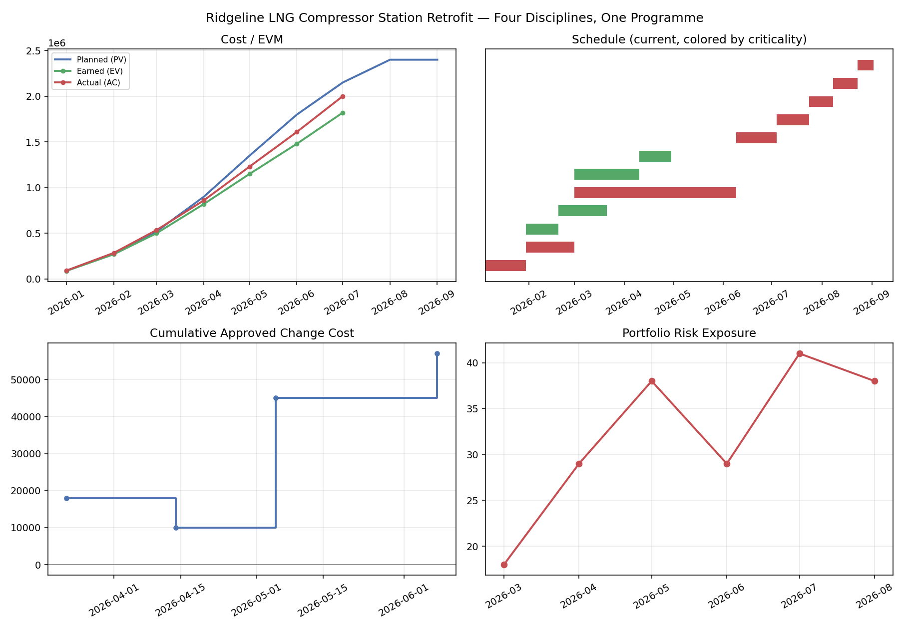

# Project Controls Reporting Engine

Composes the four tools in the project-controls toolkit, EVM dashboard,
schedule health, change control, and risk trend, against one consistent
programme, and produces a single integrated status report showing how the
four disciplines' independent findings relate to each other.

Part of a small project-controls toolkit:
[project-controls-dashboard](https://github.com/alexc-hue/project-controls-dashboard),
[schedule-health-analyzer](https://github.com/alexc-hue/schedule-health-analyzer),
[change-control-register](https://github.com/alexc-hue/change-control-register),
[risk-trend-tracker](https://github.com/alexc-hue/risk-trend-tracker),
**project-controls-reporting-engine** (this repo).



## Problem

Each tool in the toolkit answers its own question well: is the cost/schedule
picture healthy, is the schedule itself healthy, is the change log under
control, is risk exposure improving. What none of them answers alone is
whether those four answers are actually telling the same story. A programme
can show a schedule slip, a cost variance, some approved changes, and a
worsening risk in the same reporting period and still get presented as four
unrelated line items in four separate meetings, when they're often one
underlying problem seen from four angles.

## Approach

- Import each tool's existing metrics module unchanged (vendored under
  `engines/`, see Implementation) and run all four against **one shared
  fictional programme** instead of each tool's own separate demo scenario.
- Print a consolidated status report: EVM headline, Schedule Health Score,
  change control summary, and Risk Trajectory Score, side by side.
- Add one "Integrated Observations" section that states, in plain language,
  what the four independent computations agree on, without introducing any
  new predictive or causal model. It's factual juxtaposition of real
  computed numbers, not a forecast of how one discipline's number causes
  another's.

The sample programme is a fictional LNG compressor station retrofit where a
single root cause, a long-lead compressor rotor procurement delay, is
traceable independently through all four tools: it drives the schedule's
30-day slip, shows up in the EVM cost variance from the resulting expedited
freight, appears as the change register's largest approved cost item, and
was already flagged as an escalating risk months before it happened.

## Implementation

Built in Python, and deliberately reuses rather than reimplements: the
`engines/` folder holds the exact same `metrics.py` (and `cpm.py`) modules
already published in the four standalone tools, copied unchanged so this
repo is self-contained and runnable without cloning the other four
alongside it. No new EVM, CPM, change-tracking, or risk-scoring logic
exists anywhere in this repo, the only new code is the orchestration script
that calls all four and the one unified dataset that feeds them
consistently.

## Result

```
====================================================================
INTEGRATED PROGRAMME STATUS REPORT
Ridgeline LNG Compressor Station Retrofit — as of 2026-08-01
====================================================================

COST / EVM (dashboard engine)
  SPI 0.85  CPI 0.91  EAC $2,637,363  VAC $-237,363
  SPI-based forecast finish: 2026-09-10   Revised budget (BAC + approved changes): $2,457,000

SCHEDULE (schedule health engine)
  Schedule Health Score: 38.3/100  Slip: +30d  Critical/near-critical: 66.7%

CHANGE CONTROL (change engine)
  Approved: $57,000  (-5d)   Pending: $22,000   Stale pending: 0

RISK (risk trend engine)
  Risk Trajectory Score: 83.3/100  Exposure change: +0.0%   Effective mitigations: 2/3
```

Followed by the Integrated Observations section connecting the four
findings to the same root cause. A saved copy is generated alongside the
chart: see [assets/report.md](assets/report.md).

## Screenshots

**Four disciplines, one programme** — cost/EVM, current schedule by
criticality, cumulative approved change cost, and portfolio risk exposure,
all computed from the same underlying story.


## Limitations

- This is composition, not new analysis: every number here is produced by
  one of the four existing tools' unmodified logic. If a discipline's
  standalone tool has a limitation (see its own README), that limitation
  carries through here too.
- The "Integrated Observations" are a written, human-composed narrative
  connecting the four results, not an automated root-cause-detection
  algorithm. It doesn't scale to a programme where the four disciplines
  don't share an obvious common cause, that would need real correlation
  analysis, which this deliberately doesn't attempt.
- One unified dataset drives all four engines; a real deployment would need
  this fed from each tool's actual system of record (P6/MS Project, the
  cost/ERP system, the RAID log, the change register) rather than one set
  of hand-authored CSVs.

## What I learned

The hard part of this build wasn't writing new logic, there isn't any, it
was designing one dataset that stays numerically honest across four
different schemas at once: an aggregated monthly EVM timeseries, an
activity-level CPM network, a change log, and a risk panel, all describing
the same 30-day schedule slip and its downstream cost, change, and risk
consequences without any of the four disagreeing with each other. That
turned out to be a more realistic simulation of "does your data actually
add up across your reporting" than anything in the four standalone tools,
which is arguably the actual point of a reporting engine like this one.

## Run it

```bash
pip install -r requirements.txt
python reporting_engine.py
```

Swap in your own `data/*.csv` files (same schemas as the four standalone
tools, see their READMEs) describing one real programme to point this at
it. All four engines will run against whatever story the data actually
tells.
